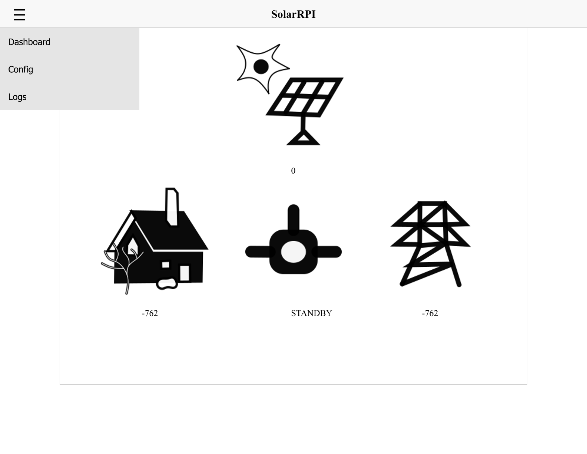
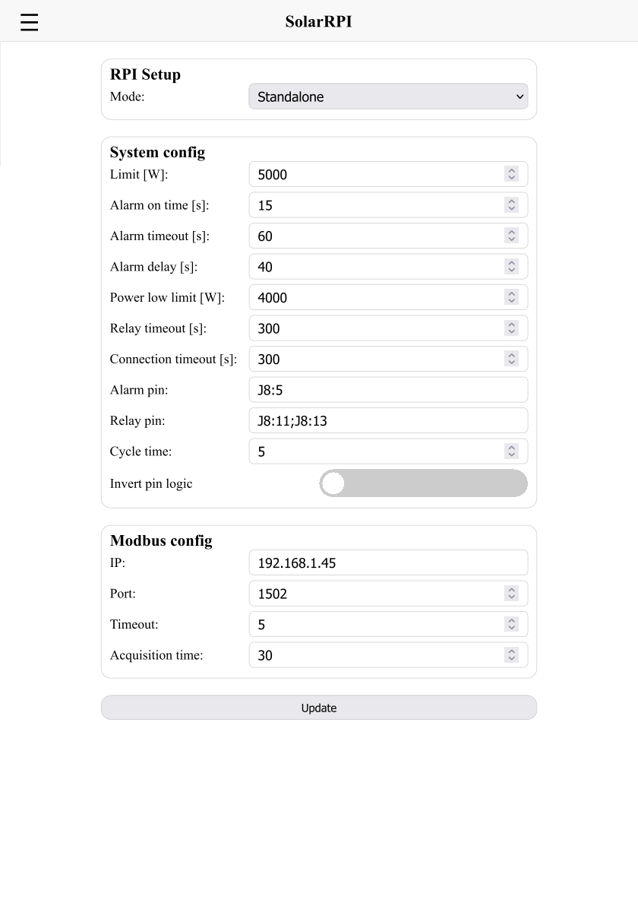

# RPI-Solar-monitoring

Connect a Raspberry PI to a Solar Edge Inverter via Modbus TCP to control power usage on other devices.

The repository features four different use cases.

- **Simulator** - This mode lets the user test the output pins.
- **Standalone** - In this mode the PI is connected via Modbus TCP to the inverter and utilizes the output devices directly.
- **Publisher** - In this mode the PI is connected via Modbus TCP to the inverter and transmits data via Mosquitto MQTT broker to another device.
- **Subscriber** - In this mode the PI is connected to the Mosquitto MQTT broker and utilizes the output devices.

In case of using the Publisher and Subscriber mode on different networks, one can use [Tailscale](https://tailscale.com/) to connect the devices together. Register for a free plan and install tailscale on bot PIs and register them. From there you receive a ipv4 adress to connect the two PIs together.

## Webpage preview

The library itself hosts a local webpage, where the user can view the current status. In the dashboard the current power flow can be viewed.



And in the config the user can setup the RPI.



## Python Setup

Download the directory and run the following commands in a terminal:
```
python3 -m venv --system-site-packages .venv

source .venv/bin/activate

pip install -r requirements.txt
```

## Daemon setup

We want the RPI to run our script on each boot so we need to setup a daemon. 
Open a new terminal and run:

```
cp start_script_template.sh start_script.sh
```
This will create a copy of the start script template. Inside the user must edit the path to the current working folder. We can use nano to do this:
```
nano start_script.sh
```
Once the file is ready, we must the following command so the script can be called by the service.
```
chmod +x /home/pi/RPI-solar-monitoring/start_script.sh
```

Now create a `systemmc` service:

```
sudo cp solar_template.service /etc/systemd/system/solar_template.service
sudo nano /etc/systemd/system/solar_template.service
```
This is the service template. Make sure to correctly set the username for your PI setup and the paths to the working directory.

Now enable and start the service
```
sudo systemctl daemon-reload
sudo systemctl enable solar.service
sudo systemctl start solar.service
```
The service can also be stopped by disabling it. In case of an software update the service must be restarted.
To check the service logs run the following command:
```
journalctl -u solar.service -f
```


## Mqqt setup

This part only applies if you need to set up the PI in Publisher mode. For that we need a mqtt broker. One common solution is to use Mosquitto mqqt. Follow this <a href="https://randomnerdtutorials.com/how-to-install-mosquitto-broker-on-raspberry-pi/">tutorial</a> for a better explanation:

Run the following commands:

```
sudo apt update

sudo apt upgrade

sudo apt install -y mosquitto mosquitto-clients

sudo systemctl enable mosquitto.service
```

Next we need to setup the mqtt credentials. Make sure these credentials match the credentials in `mqtt_config.json`.

```
sudo mosquitto_passwd -c /etc/mosuitto/passwd USERNAME
```

At this point you will be prompted to enter the password. Now we need to configure the config file.

```
sudo nano /etc/mosquitto/mosquitto.conf
```

Place this at the top of the file.
```
per_listener_settings True
```
And this at the bottom.
```
listener 1883
allow_anonymous false
password_file /etc/mosquitto/passwd
```
And now simply restart mqqt:
```
sudo systemctl restart mosquitto
```

Now in case of issues, the following commands may come usefull.

Check the journal:
```
sudo journalctl -u mosquitto -e
```
Verify permissions:
```
ls -l /etc/mosquitto/passwd
ls -ld /var/lib/mosquitto /var/log/mosquitto
```
In case there is an issue with permissions, one can change the ownership. (Not entirely sure what this does...)
```
sudo chown mosquitto:mosquitto /etc/mosquitto/passwd
sudo chmod 600 /etc/mosquitto/passwd
```

# Git updates
To update the scripts from git use:
```
git pull origin main
```
In case the user changes the files and wants to rewert:
```
git fetch origin main
git reset --hard origin/main
```
